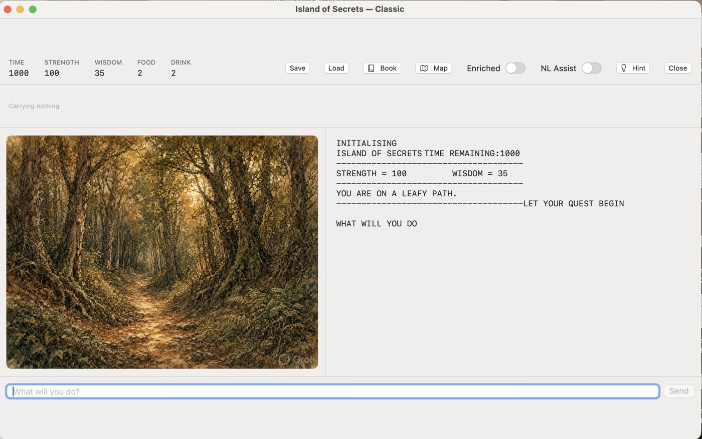
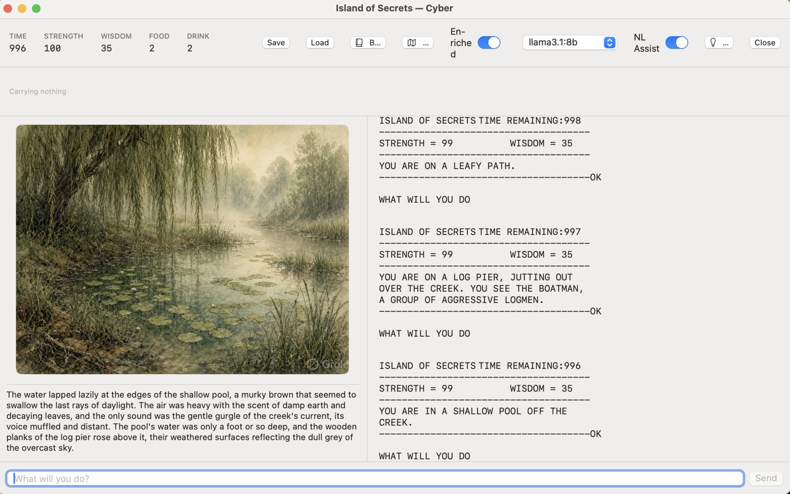
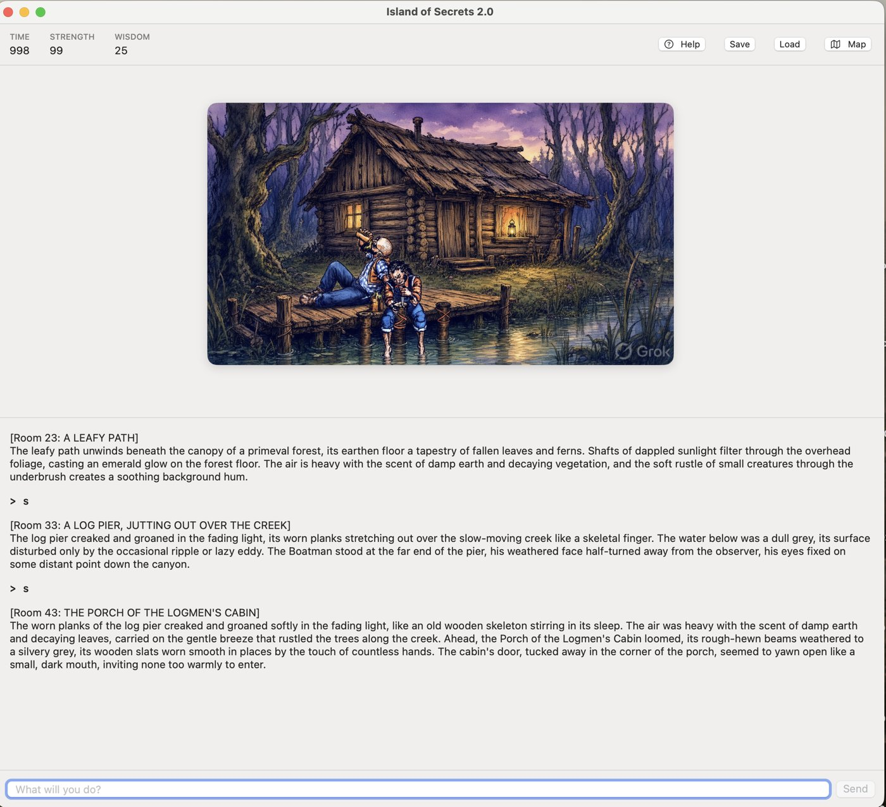
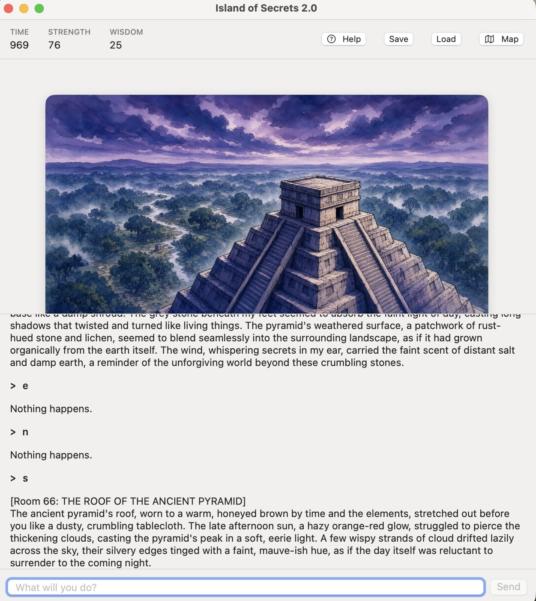

<p align="center"></p>

# Island of Secrets Redux

A fan resurrection of **_Island of Secrets_**, the 1984 Usborne type-in text
adventure by Jenny Tyler and Les Howarth, as native macOS apps.

> Adapted from the Usborne book **_Island of Secrets_** (Usborne Publishing).
> Usborne have kindly made their 1980s computer books free to download and
> allow the programs to be adapted and shared non-commercially:
> **<https://usborne.com/gb/books/computer-and-coding-books>**

## The game

Long ago, the Sky People gave the Ancients five ordinary-looking objects to
hide. Then a war darkened the Earth. Omegan was sent to gather the objects and
restore the world, but kept their power for himself instead. He still lives on
his Island of Secrets. You play Alphan, a young scholar who has only his
explorer grandfather's map to go on, and who sets out to find the objects and
bring back the light.

As in the original, the game won't tell you where the exits are or point out
every useful object. You'll need the map, careful reading and some
experimenting to survive the island, its creatures and its puzzles.

This repository contains two versions:

| | **Island of Secrets (Classic)** | **Island of Secrets 2.0** |
|---|---|---|
| What it is | The original 1984 game, unchanged | A reimagining set in the same world |
| How it works | A small BASIC interpreter runs the original program line by line | You type ordinary sentences; a local language model works out what you meant, and a rule engine decides what happens |
| Commands | The original two-word commands (`GET APPLE`, `GO NORTH`) | Free text ("pick up the apple and head north") |
| Language model | Optional (adds narration, hints, command help) | Required (via [Ollama](https://ollama.com)) |

Both versions run entirely on your own Mac. Nothing is sent to a cloud service.

### Classic

The original game, with a new illustration for every room. Turn on **Enriched**
(Cyber mode) and a local model adds a paragraph of atmosphere, drawn only from
what's actually in the room.

<p align="center">
  
  
</p>

### Island of Secrets 2.0

Type whatever you like and the game narrates what happens, with a
`[Room N]` marker on every turn so you can follow along on the map.

<p align="center">
  
  
</p>

## Requirements

- A Mac running macOS 13 (Ventura) or later. Apple silicon and Intel both work.
- **Ollama**, a free app for running language models locally. It's optional for
  Classic and required for 2.0.

That's it to *play* the downloaded apps below -- nothing else to install.
Building from source (further down) additionally needs Apple's Command Line
Tools.

### Install Ollama and a model (optional for Classic, required for 2.0)

1. Download Ollama from <https://ollama.com/download> and open it once. It then
   runs in the menu bar.
2. In Terminal, download a model (about 5 GB):

   ```sh
   ollama pull llama3.1:8b
   ```

Any model you've pulled can be picked from the dropdown in either app. Macs
with 16 GB of RAM or more will give the smoothest experience.

## Download

Go to the [Releases page](https://github.com/ozdweller/Island-of-Secrets-Redux/releases),
grab the latest `.dmg` for whichever version you want (or both), open it and
drag the app to **Applications**. Each download is a complete, ready-to-run
app -- no compiling, no Xcode, no separate Python install.

**First launch:** this project doesn't have a paid Apple Developer
certificate, so macOS treats the app as coming from an "unidentified
developer" and will refuse to open it with a plain double-click the first
time. Instead:

1. **Right-click** (or Control-click) the app and choose **Open**.
2. A dialog appears with an **Open** button this time -- click it.

You only need to do this once per app. If your Mac still refuses, open
**System Settings → Privacy & Security**, scroll down, and click **Open
Anyway** next to the app's name.

**Classic:** launch the app, then choose **Classic** to play the original
game exactly as it was, or **Cyber** to add local-LLM narration, hints and
help with commands.

**2.0:** launch the app, pick a model from the dropdown and press **Start**.

## Building from source (for developers)

Prefer to build it yourself, or want to modify the code? You'll additionally
need Apple's free **Command Line Tools**, which provide `swift` (to build the
apps) and `python3` (to run the game engines during development). The full
Xcode app also works but isn't needed.

Open **Terminal** (Applications → Utilities → Terminal) and run:

```sh
xcode-select --install
```

A window appears. Click **Install** and accept the licence. The download is
around 1 GB and takes a few minutes. If you're told the tools are already
installed, skip ahead.

Check that it worked:

```sh
swift --version
python3 --version
```

Both should print a version number. Python needs to be 3.9 or later; the
version bundled with the Command Line Tools is fine, and there's nothing to
`pip install`.

```sh
git clone https://github.com/ozdweller/Island-of-Secrets-Redux.git
cd Island-of-Secrets-Redux
chmod +x launch.command launch2.command
```

Or use **Code → Download ZIP** on GitHub and unzip it anywhere.

The first launch of each version compiles the app, which takes a minute or two.
Later launches are quick.

**Classic:** double-click `launch.command`. Choose **Classic** to play the
original game exactly as it was, or **Cyber** to add local-LLM narration, hints
and help with commands.

**2.0:** double-click `launch2.command`, pick a model from the dropdown and
press **Start**.

If macOS blocks a `.command` file the first time, right-click it and choose
**Open**.

**Terminal only (no app window):**

```sh
python3 engine/play.py                                     # Classic
python3 "Island 2.0/engine/shell.py" --model llama3.1:8b   # 2.0
```

**Building the same .dmg releases yourself:** `scripts/package_app.sh` (also
used by `.github/workflows/release.yml`) builds a universal (Apple
silicon + Intel) release build, embeds a self-contained Python runtime, and
packages a .dmg:

```sh
scripts/package_app.sh classic dist
scripts/package_app.sh island2 dist
```

### Grandpa's map (recommended)

The original game gives no on-screen directions: you find your way using the
map printed in the book. The map is Usborne's artwork, so it isn't included
here. To use it in the game:

1. Download the free _Island of Secrets_ PDF from the
   [Usborne page](https://usborne.com/gb/books/computer-and-coding-books).
2. Export pages 6–7 (the "Grandpa's map" spread) as an image.
3. Save it as `art/Grandpa's map.png` (or `.jpg`) if you built from source, or
   -- if you're using a downloaded app -- right-click the app in Finder,
   choose **Show Package Contents**, and save the image into
   `Contents/Resources/art/` instead.

The **Map** button in either app then opens it in its own window. The rest of
the book (the full story, character notes and a clues page for when you're
stuck) is worth reading too.

## Credits

- **Original game:** _Island of Secrets_ by Jenny Tyler and Les Howarth,
  illustrated by Patrick Lynch, published by Usborne Publishing (1984).
- **This adaptation:** the macOS apps, Python engines and 2.0 rule design were
  written with extensive help from AI coding assistants.
- **Artwork:** the illustrations in `art/` were created for this project with
  an AI image generator (Grok Imagine), from descriptions of the book's
  locations and characters. They are new images, not copies of the book's
  illustrations, and some carry the generator's small watermark.

## License and rights

This is a non-commercial fan project, shared under Usborne's published terms:

> You may adapt any of the programs in these books to modern computer
> languages, and share the adaptations freely online. You may not use the
> adaptations for commercial purposes. Please credit the name of the Usborne
> book from which you adapted the program, and provide a link to this webpage.
> — <https://usborne.com/gb/books/computer-and-coding-books>

- **Code** (Swift, Python, scripts): [PolyForm Noncommercial 1.0.0](LICENSE)
- **Artwork:** [CC BY-NC 4.0](art/LICENSE.txt)
- **The original game** (its story, characters, in-game text and the BASIC
  listing in `listing.bas`) remains © Usborne Publishing Ltd. The book's
  backstory and character notes appear here only as paraphrased summaries. The
  book's illustrations and map aren't redistributed.

These licences cover only this project's own work, not Usborne's material.
This project is not affiliated with or endorsed by Usborne Publishing.
